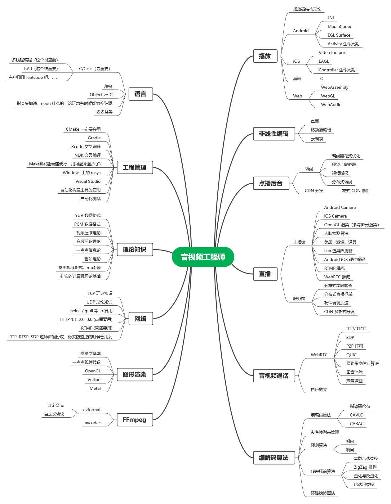

# 音视频后台开发基础汇总
## 语言
C++

shell

lua

python

go

## 网络相关
HTTPserver

## 音视频基础知识以及工具
转码

转封装

h264

Elecard .Streameye

mp4info

ffmpeg/mediainfo

## 基础中间件
mq

redis

mysql（postgres）

## 服务器高可用开发
Nginx

keepalieve+notify+rsync

## 服务器管理以及问题调试
ssh

binutils

## 技能图
 

